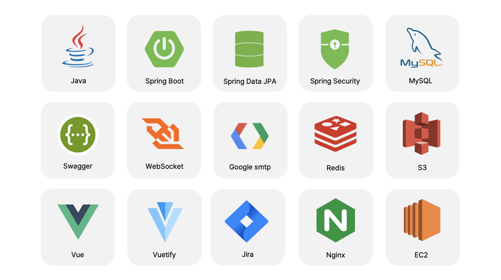
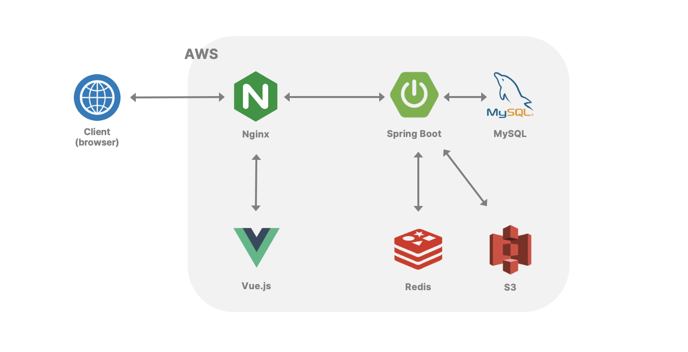

# Doit-project
> 함께 만들어가는 목표 관리 커뮤니티 

## 프로젝트 개요
### 프로젝트 소개 
- 개발 기간 : 2021.01.06 ~ 2021.02.19
- 웹앱 플랫폼 : Doit (두잇) 
- 한 줄 소개 : 이루고 싶은 목표를 하루단위로 쪼개 실천해 나가면서 목표를 습관으로 바꿔나가도록 돕는 플랫폼
    -   '모든 사람이 강한의지를 갖고 있지는 않다는 문제점' 에서 시작
    -   함께할 때 더 즐겁고, 동기부여를 원하는 사람들을 위한
    -   무료한 일상에 새로운 습관을 더하고 싶은 사람들을 위한
    -   평소 매번 실패했던 목표를 나의 습관으로 바꾸고 싶은 사람을 위한 SNS 플랫폼
- [프로젝트 노션](https://ssafy-project.notion.site/SSAFY-4-fa6ee2c4bebe4a12b63e3bbc999a36a5)

### 기술 스택 및 협업 도구

## 아키텍처

## 주요기능
[Doit 주요기능 보러가기](https://github.com/buri-1029/Doit-project/wiki/Doit-Feature)
